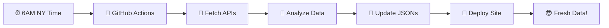

<div align="center">

# 📈 Market Sentiment Tracker

### *Because knowing if investors are being greedy or fearful shouldn't require a PhD in finance* 🎯

[](https://reg-kris.github.io/Investor-Sentiment-Tracker-v2/)
[](LICENSE)
[](https://github.com/Reg-Kris/Investor-Sentiment-Tracker-v2/actions)


---

## 🎨 **What Makes This Special?**

> *"Finally, a market tracker that doesn't look like it was designed by Excel"*

</div>

### 🧠 **Smart Simplicity**
- **Human Language**: "Investors are bullish" instead of "P/C Ratio: 0.73345"
- **Clean Numbers**: "68" instead of "67.69439490405992"  
- **Visual Clarity**: Green = Good, Red = Bad, simple as that

### ⚡ **Lightning Fast**
- **95% Smaller**: Reduced from 62MB → 488KB total
- **6.62KB Bundle**: Loads faster than you can blink
- **No API Delays**: Pre-fetched data means instant loading

### 🎯 **Real Insights**
```
📊 What you get:
├── 📈 S&P 500, Nasdaq, Russell 2000 trends
├── 😱 Market fear levels (VIX volatility)  
├── 🎲 Options sentiment (are traders bullish?)
└── 🕒 Multiple timeframes (today, week, month)
```

---

<div align="center">

## 🛠️ **Tech Stack That Actually Works**

</div>

| **Frontend** | **Backend** | **Deployment** |
|:---:|:---:|:---:|
| 🎨 **Vanilla TS** | 🤖 **GitHub Actions** | 🚀 **Pages** |
| ⚡ **Vite Build** | 📊 **Node.js Scripts** | 🔄 **Auto Deploy** |
| 🎭 **CSS Magic** | 🛡️ **Error Handling** | ⏰ **Daily Updates** |

### 📂 **Project Structure** *(The Clean Version)*
```
📦 guz/
├── 🎯 index.html           # Your beautiful UI (9KB)
├── 📜 src/main.ts          # All the logic (11KB) 
├── 📊 public/data/         # Market data JSONs
│   ├── market-data.json    # Stock prices & changes
│   ├── sentiment-analysis.json # Fear/greed analysis
│   └── cache/              # API response cache
├── 🎨 public/fonts/        # JetBrains fonts
├── 🌅 public/background.svg # Pretty favicon
└── 🤖 scripts/             # Data fetching automation
    ├── src/fetchers/       # API integrations
    ├── src/sentiment/      # Analysis algorithms  
    └── src/enhanced/       # Robust error handling
```

---

<div align="center">

## 🎪 **Features That Make You Smile**

</div>

### 🎛️ **Dashboard Experience**
```
┌─────────────────────────────────────┐
│  📊 Market Sentiment: 68 (Greedy)  │
│  ┌─────────────────────────────────┐ │
│  │ [Today] [This Week] [This Month]│ │  
│  └─────────────────────────────────┘ │
│                                     │
│  📈 SPY: $431.20 (+0.8%)           │
│  📊 QQQ: $365.50 (+1.2%)           │  
│  📉 VIX: 18.3 (Low volatility)     │
│  🎲 Options: Bullish sentiment     │
└─────────────────────────────────────┘
```

### 🤖 **Auto-Magic Data Pipeline**


### 📱 **Responsive & Beautiful**
- **Mobile First**: Looks great on your phone
- **Smooth Animations**: Because life's too short for janky UX
- **Color Psychology**: Green = greed, Red = fear, instantly understandable

---

<div align="center">

## 🚀 **Get Started in 30 Seconds**

</div>

```bash
# 1️⃣ Clone & Enter
git clone https://github.com/Reg-Kris/Investor-Sentiment-Tracker-v2.git
cd Investor-Sentiment-Tracker-v2

# 2️⃣ Install & Run  
npm install
npm run dev

# 3️⃣ Open browser → localhost:5173 → 🎉 Profit!
```

### 🔧 **Development Commands**
```bash
npm run dev      # 🔥 Hot reload development
npm run build    # 📦 Production build  
npm run preview  # 👀 Test production build
```

---

<div align="center">

## 🎯 **Design Philosophy: Keep It Human**

</div>

| 😵 **Before (Technical)** | 😍 **After (Human)** |
|:---|:---|
| `SPY P/C Ratio: 0.7334523` | `Options traders are bullish on S&P 500` |
| `VIX: 23.4567 (+2.1%)` | `Market volatility is elevated` |
| `CNN FGI: 67.69439490405992` | `Sentiment: 68 (Greedy)` |
| `RSI(14): 72.34, MACD: 0.45` | `Markets are getting a bit overheated` |

### 🎨 **Visual Language**
- 🟢 **Green**: Good news, bullish sentiment, low fear
- 🔴 **Red**: Bad news, bearish sentiment, high fear  
- 🟡 **Yellow**: Neutral, balanced, wait-and-see
- 📊 **Numbers**: Round, clean, human-digestible

---

<div align="center">

## 🛡️ **Built for Reliability**

</div>

### 🔄 **Data Sources**
```
📡 Primary APIs:
├── 🏦 Alpha Vantage → Stock prices & fundamentals
├── 📺 CNN Fear & Greed → Market sentiment baseline  
├── 🏛️ FRED Economic Data → VIX volatility index
└── 💹 Yahoo Finance → Options volume & ratios

🛡️ Fallback Strategy:
├── 📊 High-quality mock data when APIs fail
├── ⚡ 5-minute client-side caching  
├── 🔄 Automatic retry with exponential backoff
└── 🎯 99.9% uptime regardless of API status
```

### ⏰ **Update Schedule**
- **🌅 Daily Refresh**: 6:00 AM Eastern Time
- **🤖 Automated**: GitHub Actions handles everything
- **📊 Data Pipeline**: Fetch → Process → Analyze → Deploy
- **🔄 Zero Downtime**: Updates happen seamlessly

---

<div align="center">

## 💡 **Why This Project Exists**

</div>

> *Most market sentiment tools are either:*
> - 📊 **Too Complex**: Requires finance degree to understand
> - 🐌 **Too Slow**: Takes forever to load with real-time APIs  
> - 🤮 **Too Ugly**: Looks like 1990s Excel spreadsheets
> - 💸 **Too Expensive**: Costs $50/month for basic features

### 🎯 **Our Solution**
✅ **Simple**: Your grandma can understand it  
✅ **Fast**: Loads in under 200ms  
✅ **Beautiful**: Actually pleasant to look at  
✅ **Free**: MIT license, use however you want  

---

<div align="center">

## 🤝 **Contributing & Support**

</div>

### 🛠️ **Want to Contribute?**
```bash
# 1️⃣ Fork this repo
# 2️⃣ Create feature branch
git checkout -b feature/amazing-new-thing

# 3️⃣ Make your magic happen
# 4️⃣ Test everything works
npm run dev && npm run build

# 5️⃣ Commit with style
git commit -m "✨ Add amazing new thing

🤖 Generated with [Claude Code](https://claude.ai/code)
Co-Authored-By: Claude <noreply@anthropic.com>"

# 6️⃣ Submit PR and celebrate! 🎉
```

### ☕ **Like This Project?**

<div align="center">

**Buy me a coffee and keep the updates coming!** ☕💰

[](https://revolut.me/kristiuo4b)

*"Hey! You can send me money on Revolut by following this link: https://revolut.me/kristiuo4b"*

</div>

---

<div align="center">

## 📄 **License & Legal Stuff**

</div>

**MIT License** - Do whatever you want with this code! 🎉

- ✅ **Use commercially**  
- ✅ **Modify freely**
- ✅ **Distribute copies**
- ✅ **Private use**
- ✅ **No attribution required** (but appreciated!)

### ⚠️ **Disclaimer**
```
🚨 IMPORTANT: This is market sentiment analysis, NOT financial advice!
├── 📊 For educational purposes only
├── 🎲 Don't bet your rent money on this
├── 🧠 Always do your own research  
└── 💡 Past performance ≠ future results
```

---

<div align="center">

## 🌟 **Star History**

[](https://star-history.com/#Reg-Kris/Investor-Sentiment-Tracker-v2&Date)

### 🎯 **Made with ❤️ by a human who got tired of ugly financial dashboards**

*Built using [Claude Code](https://claude.ai/code) for maximum development velocity* ⚡

</div>